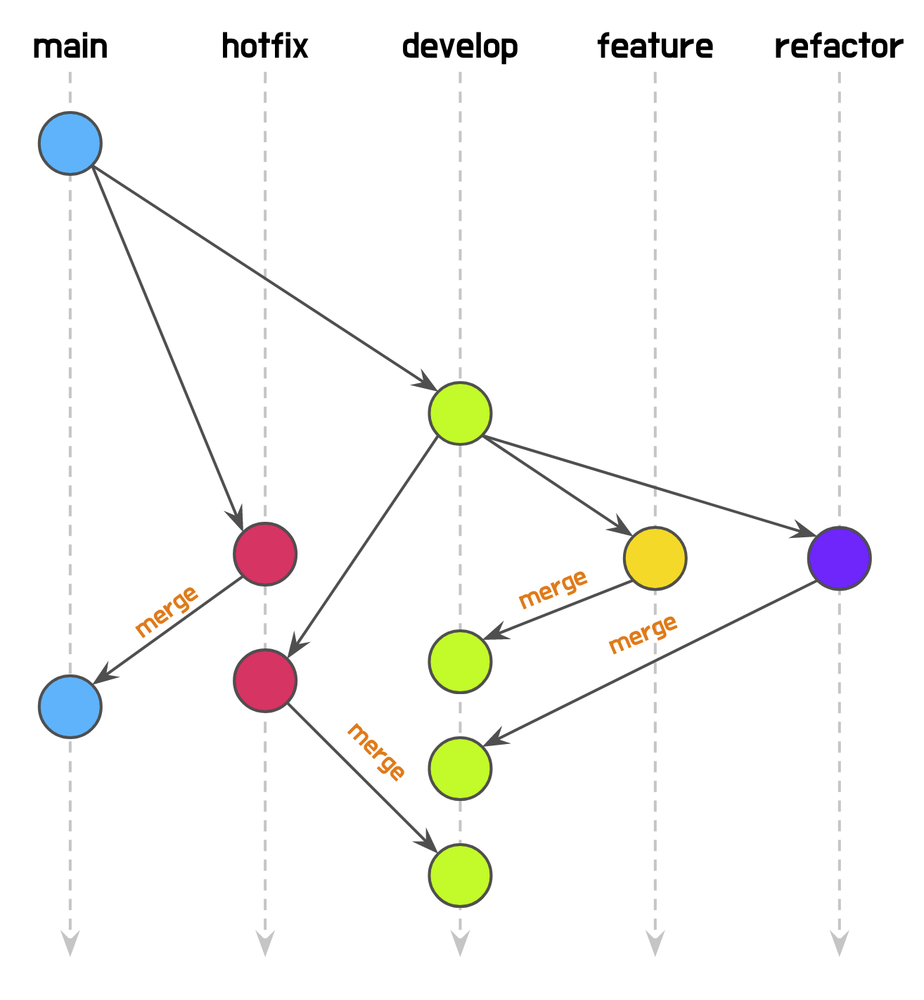
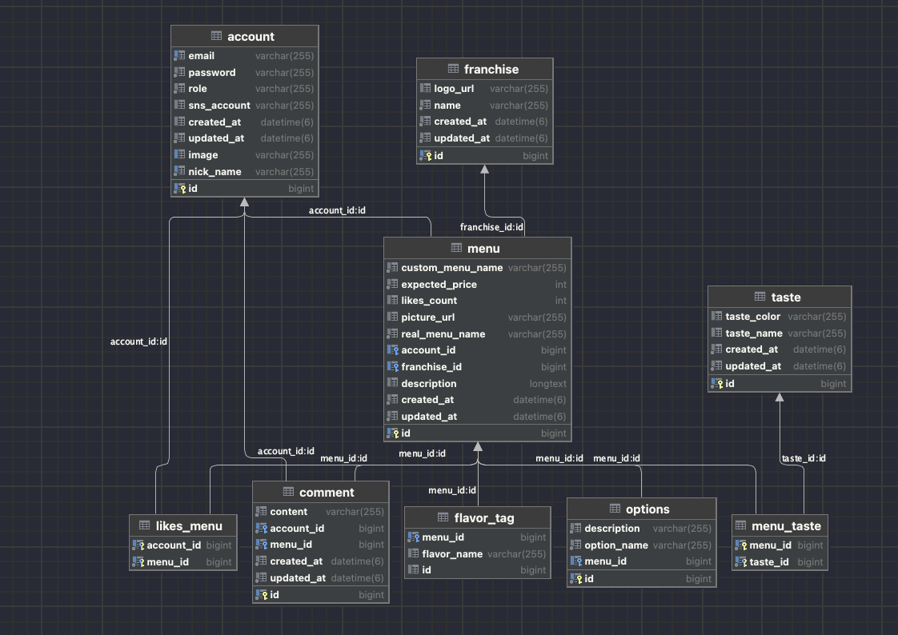
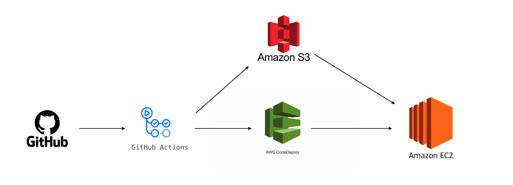
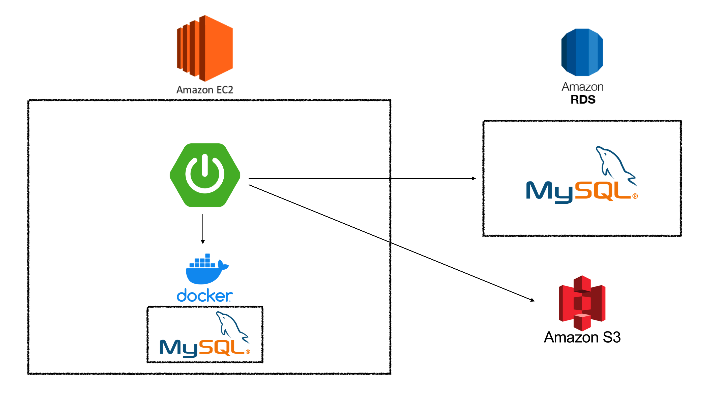

# 맛이어때

## Member

| 김지웅  | 정해민  | 최지훈  | 최현웅  |
|------------------------------------------------------------------------------------------------------------------------------------|------------------------------------------------------------------------------------------------------------------------------------|------------------------------------------------------------------------------------------------------------------------------------|------------------------------------------------------------------------------------------------------------------------------------|
| 역할                                                                                                                                 | ㅁㅁ                                                                                                                                 | ㅁㅁ                                                                                                                                 | ㅁㅁ                                                                                                                                 |
| [wisehero](https://github.com/wisehero)                                                                                                                       | [haemin-jeong](https://github.com/haemin-jeong)                                                                                                | [chlwlgns524](https://github.com/chlwlgns524)                                                                                                 | [choi1204](https://github.com/choi1204)                                                                                                    |   

### 기획서 및 와이어프레임

[맛이어때 Notion 기획서](https://backend-devcourse.notion.site/938a431ee41a4c358f5826673cfbea88) 
[맛이어때 와이어프레임](https://www.figma.com/file/giZ2QkrKQT8uZ0K23HoNUI/%EB%82%98%EB%A7%8C%EC%9D%98-%EB%A9%94%EB%89%B4)

### Skills

### Collaborate And Tools

### Branch

### ERD

### CI/CD

### Development Environment

### API 문서

[맛이어때 API 문서](http://13.125.177.126:8080/docs/index.html)

### 클라이언트 GitHub Repository
[맛이어때 FE Repository](https://github.com/prgrms-web-devcourse/Team-Tasty-Masiottae-FE)

